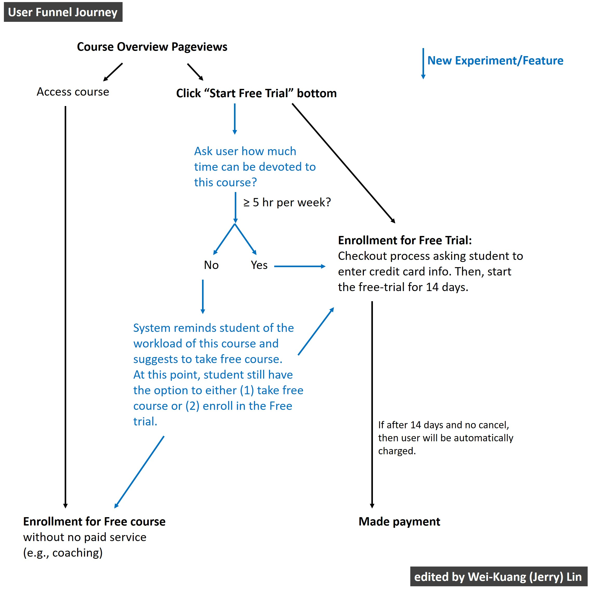
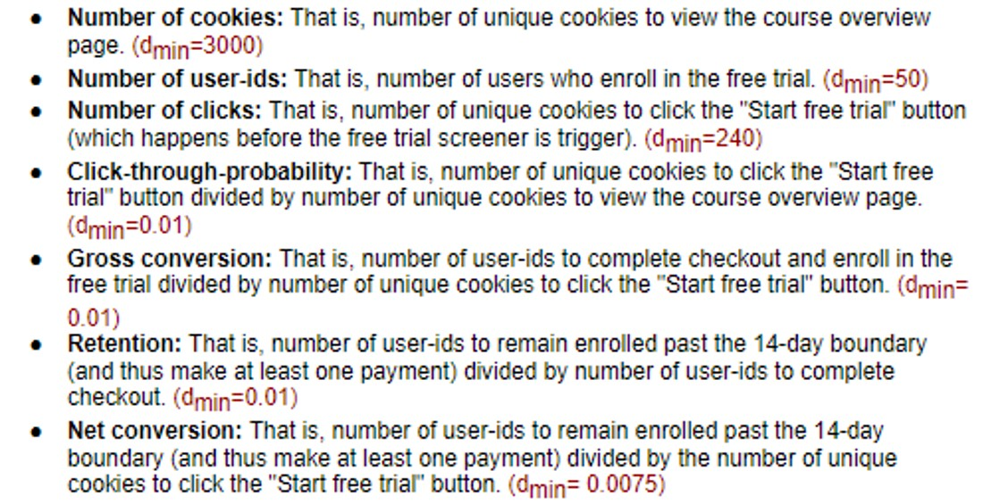
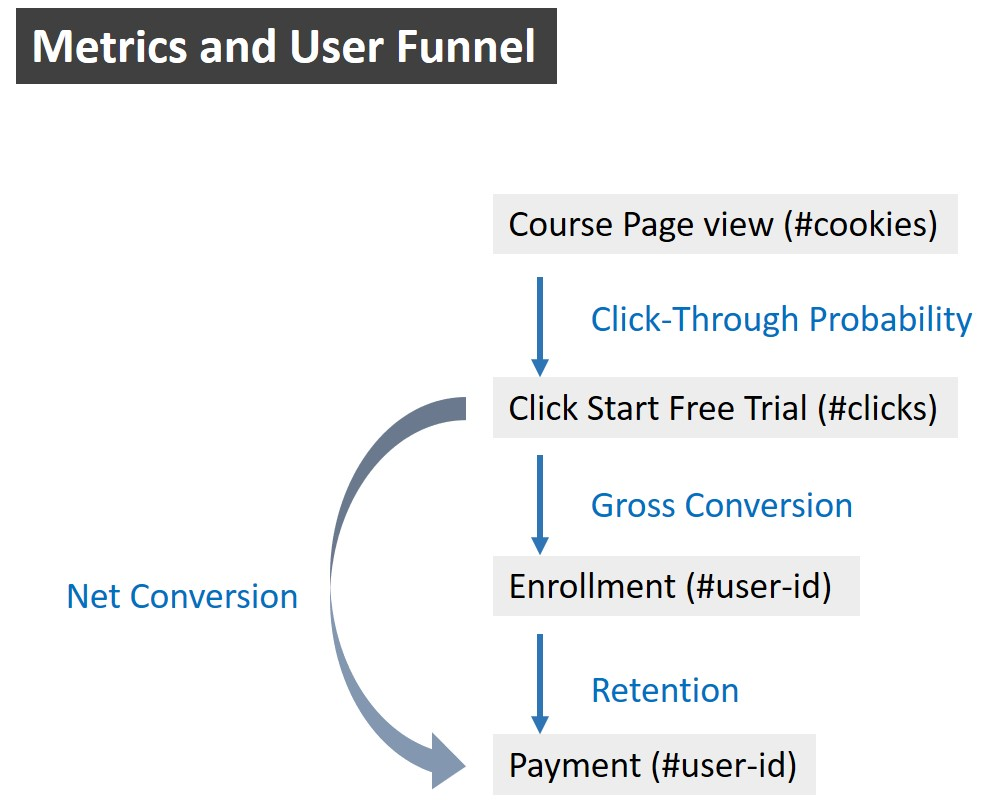

# Udacity AB Testing Final Project
Udacity website has a new design and wants to improve user experience. This project aims at evaluating whether this new design can be effective in production. The project will go through experiment design and analysis to collect statistical evidences to make a reasonable decision to launch this new design or not. 

# Final Project Instructions
Linke to the Final Project Description - https://docs.google.com/document/u/1/d/1aCquhIqsUApgsxQ8-SQBAigFDcfWVVohLEXcV6jWbdI/pub

 

# Hypothesis and expectation of this new feature
The hypothesis was that this might set clearer expectations for students upfront, thus reducing the number of frustrated students who left the free trial because they didn't have enough time without significantly reducing the number of students to continue past the free trial and eventually complete the course. **If this hypothesis held true, Udacity could improve the overall student experience and improve coaches' capacity to support students who are likely to complete the course.**

The unit of diversion is a cookie, although if the student enrolls in the free trial, they are tracked by user-id from that point forward. The same user-id cannot enroll in the free trial twice. For users that do not enroll, their user-id is not tracked in the experiment, even if they were signed in when they visited the course overview page.

# Metric List

 

## 1. Metric Choice
List which metrics you will use as invariant metrics and evaluation metrics here. For each metric, explain both why you did or did not use it as an invariant metric and why you did or did not use it as an evaluation metric. Also, state what results you will look for in your evaluation metrics in order to launch the experiment.

#### Invariant Metrics 
*The key is to find the steps **before the new feature**.

* **Number of cookies (page views) :** The course overview page is prior to the new feature. Thus, this metric should be the same between control and experiment groups. 

* **Number of clicks (start free trial bottom):** This metric is prior to the new feature. Thus, this metric should not change between control and experiment groups. 

* **Click-through-probability(=clicks/page views):**  Same reason. The click and course page view are prior to the new feature, so there should be no change in this metric between the control and experiment groups. 

#### Evaluation Metrics 
*The key is to identify the steps **after the new feature**. Thus, metrics which are related to "enrollment" or "payment" can be evaluation metric.*

* **Gross Conversion (=enrollment/click):** "enrollment" occurs after the new feature, and "click" (the denominator) is invariant, so this metric is movable and can be used as an evaluation metric. We expect that gross conversion to **go down** in the experiment, because *the design of this new feature is to divert less-committed people to the free course, instead of enrollment in the free trial. This causes less people to be in the "enrollment".

* **Net conversion (=payment/click):** "payment" occurs after this new feature, and "click" (the denominator) is invariant, so this metric is movable and can be used as an evaluation metric. We expect the net conversion to be **higher** in the experiment, because the new feature is supposed to select more committed people who are likely to stay in the free trail and make payment at the end. 

* **Retention (=payment/enrollment):** Both of "payment" and "enrollment" occur after this new feature. We expect the retention rate to be **higher** in the experiment, because the new feature is supposed to select more committed people who are likely to make payment. 

#### Bad Metrics
* **Number of user-ids (enrollment):** In the experiment, enrollment stage is after the new feature, but enrollment (count) may not be a good evaluation metric. The reason is that it's not good to use a pure count metric as the evaluation metric in the funnel process analysis. In the funnel process, the number of the counts for each step is conditioned to previous step. Thus, it's good to use rate or probability which is normalized, instead of a counting number.

## 2. Variability

**Summary of Variability**

The estimated variability is based on the page view = 5000. If the SE is large, then we might need to collect a huge amont of data in order to evaluate this this metric.

|Metric| Standard Error|
|---   |            ---|
|Gross Conversion|0.0202|
|Retention       |0.0549|
|Net Conversion  |0.0156|

> **Note:** Retention's SE is relatively large. In section "3. Sizing", We will check if we can collect enough data in order to have enought power to evaluate Retention.

**Question:** Do you expect the analytic estimates to be accurate? That is, for which metrics, if any, would you want to collect an empirical estimate of the variability if you had time?

> **My answer:** 
I would like to collect empirical estimates of variability for (1) **Gross Conversion** and (2) **Net Conversion**, because for these metrics, their unit of diversion is not the same as the unit of analysis. In such case, the analytic form of variability is usually underestimated (smaller than the truth). Thus, it's better to use bootstrap method to obtain the empirical estimate of the variability. 

|Evaluation metric | Numerator (unit of diversion) | Denominator (unit of analysis)  |
|------------------|-------------------------------|---------------------------------|
|Gross Conversion  | enrollment (user-id)          | click (cookie)                  |
|Retention         | payment (user-id)             | enroll (user-id)                |
|Net Conversion    | payment (user-id)             | click (cookie)                  |
>>

## 3. Sizing vs. Duration vs. Exposure

#### My thinking process:  
1. I will compute the required sample size for each evaluation metric, based on the (1) baseline data, (2) minimally important difference (dmin) , (3) alpha = 0.05, and (4) beta=0.2.

2. On-line calculator will be a great tool for this task: https://www.evanmiller.org/ab-testing/sample-size.html

3. Convert the required "sample size" into required "page views" for both control and experiment groups.

4. Then, check if our system can reach the sample size in a short time (usually ~ 30 days). If a metric need more than 30 days to collect, we might need to drop it or re-design the experiment.

5. Based on the required page views, I will select the maximum page views among evaluation metrics.

#### Size  -  Gross Conversion 
* dmin = 0.01
* GC = n_enroll / n_click  = Probability of enrolling, given click  = 0.206250 (baseline)
* Required Sample Size in each group, N=25835 (using Online-calculator).
* Required n-click (two groups) = 2 * 25835 = 51670
* Then, we want to know how many page view can reach the number of required clicks.
* Based on the ratio, there will be 3,200 clicks among 40,000 page views.
* Now, we need to have [2*25835 = 51,670] clicks, so  we need  (40000 * 51670) / (3200)  = 645,875 page views.

#### Size - Retention
* dmin = 0.01
* RT = (n of payment) / n_enroll = Probability of payment, given enroll = 0.530000
* Required Sample Size in each group, N=39115 (using Online-calculator).
* Two groups of required enrollments = 2 * 39115 = 78230
* Based on the ratio, there will be 660 enrollments given 40000 page views.
* Thus, to reach 78,230 enrollments, then we need 4,741,212 page view

#### Size - Net Conversion
* dmin = 0.0075
* NC =  (n of payment) / n_click = Probability of payment, given click = 0.109313
* Required Sample Size in each group, N=27,413 (using Online-calculator).
* Two groups of required n-click = 2 * 27413 = 54,826
* Based on the ratio, there will be 3,200 clicks given 40000 page views.
* Now, we need to have 2 * 27413 = 54,826 clicks, we need 685,325 page views.

**Summary of Sizing**
* This is the sample size to reach these wanted statistics parameters: 0.05 alpha (Type I error) and 0.2 Beta (Type II error)
* With 100% traffic, the site estimated that there will be 40000 page views per day.

|Metrics| Required page view (cookies)| Required days with 50% traffic | Required days with 100% traffic |
|-|-|-|-|
|Gross Conversion| 645,875|33 days| 17 days|
|Retention|4,741,212|238 days|119 days|
|Net Conversion|685,325|35 days|18 days|

> Note: Retention need 119 days (17 weeks =~ 4 months) to obtain wanted sample size, even if we use 100% of the traffic. This is too long for a on-line experiment. I will drop "Retention" from the list of evaluation metrics.

**Question:** Which evaluation metrics did you choose?

> **ANS:** (1) gross conversion and (2) net conversion

**Question:** Will you use Bonferroni Correction? 

> **ANS:** These evaluation metrics are highly correlated, so Bonferroni would be too conservative.

**Question:** Is the change risky enough that you wouldn't want to run on all traffic?

> **ANS:** The feature is to add additional question to ask users about the commitment time and then it diverts users into different processes. I think this new feature is not very risky, because this feature just adds an additional branching of the process, instead of changing an entire new user funnel process. 

**Question:** What percentage of Udacity's traffic would you divert to this experiment (assuming there were no other experiments you wanted to run simultaneously)?
 
> **ANS:** Just to be safe, we can use the 90% of traffic. 

**Question:** How many page view that we need? 

> **ANS** 685,325 which is the maximum required page views among (1) gross conversion and (2) net conversion

## 4. Data
The data for you to analyze is [here](https://docs.google.com/spreadsheets/d/1Mu5u9GrybDdska-ljPXyBjTpdZIUev_6i7t4LRDfXM8/edit#gid=0). This data contains the raw information needed to compute the above metrics, broken down day by day. Note that there are two sheets within the spreadsheet - one for the experiment group, and one for the control group.

#### Column definition:

* **Page views:** Number of unique cookies to view the course overview page that day.

* **Clicks:** Number of unique cookies to click the course overview page that day.

* **Enrollments:** Number of user-ids to enroll in the free trial that day.

* **Payments:** Number of user-ids who who enrolled on that day to remain enrolled for 14 days and thus make a payment. (Note that the date for this column is the start date, that is, the date of enrollment, rather than the date of the payment. The payment happened 14 days later. Because of this, the enrollments and payments are tracked for 14 fewer days than the other columns.)

## 5. Sanity Checks
Use invariant metrics to perform sanity check to make sure that this experiment was well implemented.

Here are my three invariant metrics:
1. Number of cookies (simple count)
2. Number of clicks (simple count)
3. Click-through-probability (probability)

Hints:
> If the invariant metric is a **simple count** that should be randomly split between the 2 groups, you can use a **binomial test** as demonstrated in Lesson 5. Otherwise, you will need to construct a **confidence interval** for a **difference in proportions** using a similar strategy as in Lesson 1, then check whether the difference between group values falls within that confidence level.

### Summary of Sanity Check

* Count Metric

> **My thinking process for Sign Test (Binomial test) :** 
>> 1. If the metric is a simple count, then I will use Sign Test (Binomial test) to perform the sanity check. 
>> 2. The key is to realize each day is an independent trial and the success can be defined as "Control > Experiment". 
>> 3. The assumption is that **page views** should be equally and randomly divided into two groups. Therefore, some days Control group may have more page view than Experiment group, and this chance is expected to be 0.5.
>> 4. Then, the "binomial test" will test if the observed data match our expectation. In this case, if p-value > 0.05, then this is the statistical evidence to support no difference between two groups.

> **My thinking process for using Confidence interval (CI) to perform sanity check :** 
>> 1. The assumption is that the invariant metric should the same between two groups, so the the ratio of Control to Experiment should be close to 1:1 or we can say p = (N of Control)/(total) is about 0.5.
>> 2. The strategy is to obtain the 95% confidence interval (95%CI) on the expected p, given the expected p=0.5 and observed N.
>> 3. The decision-making process is that if the observed $\hat{p}$ is in this 95%CI, then sanity check pass!, because it's acceptable to observe such $\hat{p}$ at the 95% confidence level.

|Metric |Sign-Test p-value |Observed values |95% confidence interval on expected value| Sanity Check Results|
|--|--|--|--|--|
|Number of cookies (simple count)     |p-value 0.324|0.5006 |[0.4988, 0.5012]| Sign Test and 95%CI check are all good|
|Number of clicks (simple count)      |p-value 1.0  |0.5005 |[0.4959, 0.5041]| Sign Test and 95%CI check are all good|

* Probability Metric

> **My thinking process for using Confidence interval to perform sanity check :**     
>> 1. The assumption is that the probability should be the same in two groups.
>> 2. Thus, we can test if the difference between two groups is close to zero.
>> 3. The strategy is to obtain the 95% confidence interval on the difference. By using this method, we need to use pooled probability to compute the SE for difference.
>> 4. The decision-making process is that if this 95%CI of difference includes zero, then sanity check pass!

    
|Metric |Observed difference |95% confidence interval on difference| Sanity Check Results|
|--|--|--|--|
|Click-through-probability (probability) |0.000056 |[-0.0012, 0.0014]| Good, because the 95%CI of difference includes zero |

## 6. Effect Size Test and Sign Test
For each of your evaluation metrics, give a 95% confidence interval around the difference between the experiment and control groups. Indicate whether each metric is statistically and practically significant.

For each of your evaluation metrics, do a sign test using the day-by-day data, and report the p-value of the sign test and whether the result is statistically significant.

## 7. Results Summary

|Evaluation Metric| Observed Difference| Minimal Practical Significance (dmin)| 95% Confidence Interval on Diff.|Statistical Significance?| Practical Significance?| Sign Test - Statistical Significance?| Final Comment|
|---|---|---|---|---|---|---|---|
|Gross Conversion (enrollment/click)|-0.02055|-0.01|[-0.0291, -0.0120]|Yes |Yes |Yes| All good|
|Net Conversion (payment/click)|-0.00487|+0.0075|[-0.0116, 0.0019]|No |No, because the difference is negative which is not our expectation |No| Not good|

## 8. Recommendation
* Since our evaluation metrics did not pass all tests, I will not launch this feature.

## 9. Follow-Up Experiment
Give a high-level description of the follow up experiment you would run, what your hypothesis would be, what metrics you would want to measure, what your unit of diversion would be, and your reasoning for these choices.

* This is a good read: https://zacks.one/udacity-a-b-testing-by-google/#Sign-Test. 
* The author suggested two experiments to improve the early cancellation.
